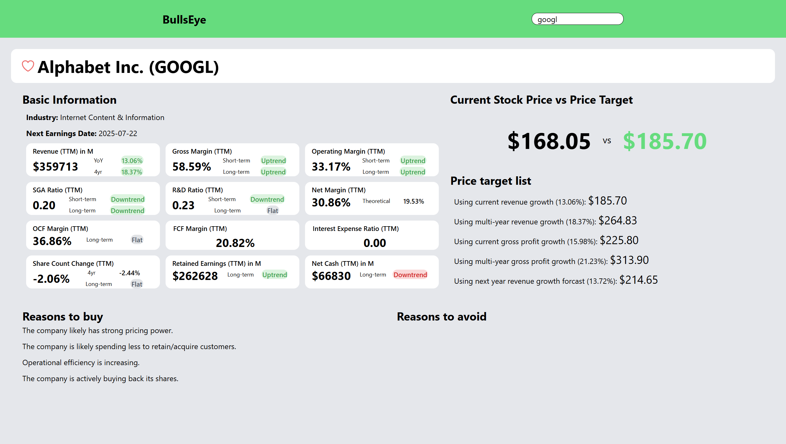

# 🐂 BullsEye

A simple full-stack stock analysis tool built with Rust, TypeScript, and PostgreSQL.

Bullseye is built as a personal project to analyze earnings and financial trends of companies. (⚠️The scraping logic is not included in this repository)

## Screenshot

